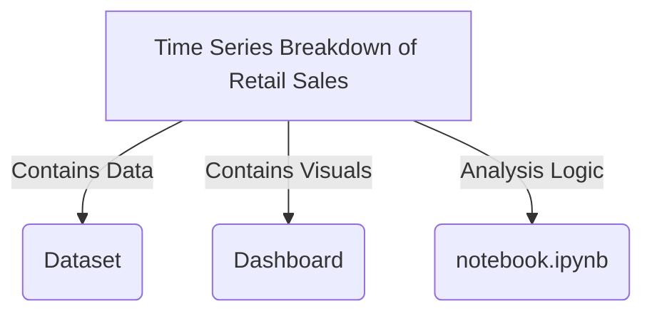

<div align="center">
  <h1>📈 Time Series Breakdown of Retail Sales</h1>
  <p>
    <strong>Analyzed & Visualized Walmart Sales Data for Strategic Insights</strong>
  </p>
  <p>
    <a href="#dataset">Dataset</a> •
    <a href="#notebook-analysis">Analysis</a> •
    <a href="#dashboard">Dashboard</a> •
    <a href="#acknowledgments">Acknowledgments</a> •
    <a href="#author">Author</a>
  </p>
</div>

---

## 📌 Project Overview
This project focuses on analyzing retail sales data using time series techniques to uncover trends, seasonality, and key drivers of performance. The analysis is performed using Python in a Jupyter Notebook, and the insights are visualized in an interactive Power BI dashboard.

## 📂 Project Structure

Here is the directory structure of the project. Click on the folder/file names to navigate to the relevant section.



> **Note:** If the interactive diagram above doesn't work (e.g., on mobile), use the links below:

- 📂 **[Dataset](#dataset)**
  - `Walmart.csv`: Raw sales data.
- 📂 **[Dashboard](#dashboard)**
  - `walmart.pbix`: Power BI interactive report.
  - `Images/`: Screenshots of the dashboard.
- 📄 **[Notebook Analysis](#notebook-analysis)**
  - `notebook.ipynb`: Python code for data cleaning, EDA, and Time Series modeling.

---

## <a id="dataset"></a>📊 Dataset

The dataset used in this project is `Walmart.csv`, located in the `Dataset/` folder. It contains historical sales data for various stores.

- **Source**: [Walmart Store Sales Forecasting (Kaggle)](https://www.kaggle.com/datasets/yasserh/walmart-dataset)
- **Key Features**:
  - `Date`: The week of sales.
  - `Store`: The store number.
  - `Weekly_Sales`: Sales for the given store.
  - `Holiday_Flag`: Whether the week is a special holiday week.
  - `Temperature`, `Fuel_Price`, `CPI`, `Unemployment`: Economic indicators.

---

## <a id="notebook-analysis"></a>🐍 Notebook Analysis

The `notebook.ipynb` file contains the complete data science workflow:
1.  **Data Preprocessing**: Handling missing values, converting dates, and merging data.
  2.  **Exploratory Data Analysis (EDA)**: Visualizing sales trends over time, seasonal effects, and correlations.
3.  **Time Series Decomposition**: Breaking down sales into trend, seasonality, and residual components.
4.  **Forecasting**: (If applicable) Using models like ARIMA or Prophet to predict future sales.

To run the notebook:
```bash
jupyter notebook notebook.ipynb
```

---

## <a id="dashboard"></a>📈 Dashboard

The interactive dashboard is built using **Power BI** (`Dashboard/walmart.pbix`). It provides an executive summary of the sales performance.

### Key Visuals:
- **Sales Trends**: Weekly and monthly performance.
- **Store Comparison**: Top and bottom performing stores.
- **Impact Analysis**: How external factors (Temperature, Fuel Price) affect sales.

*To view the dashboard, you need [Microsoft Power BI Desktop](https://powerbi.microsoft.com/desktop/).*

---

## <a id="installation"></a>⚙️ Installation & Usage

1.  **Clone the Repository**
    ```bash
    git clone https://github.com/your-username/your-repo-name.git
    cd "Time Series Breakdown of Retail Sales"
    ```

2.  **Install Dependencies**
    Ensure you have Python installed. Install the required libraries:
    ```bash
    pip install pandas numpy matplotlib seaborn scikit-learn
    ```

3.  **Run the Analysis**
    Launch Jupyter Notebook to view the code and insights.

4.  **Open the Dashboard**
    Open `Dashboard/walmart.pbix` in Power BI Desktop.
    


---

## <a id="acknowledgments"></a>🙏 Acknowledgments

This project was developed as part of a training program at **Elevvo**. I would like to express my gratitude to the instructors for their guidance and for providing this opportunity to work on real-world datasets.

---

## <a id="author"></a>👤 Author

**Mohamed Younis**

- 💼 [LinkedIn](https://www.linkedin.com/in/mohamedyounis/)
- 🐙 [GitHub](https://github.com/mohamedyounis10)

---

## <a id="license"></a>📝 License

This project is open-source and available under the [MIT License](LICENSE).

